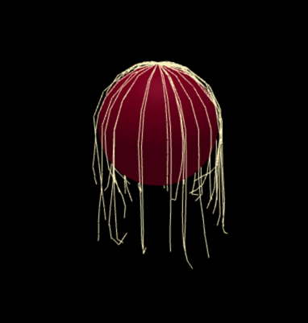

# A Particle Based Simulation

The simulation is visualized using [Three.js](https://threejs.org/).
It is hosted [here](https://jonasnoki.github.io/ca_particles_no_react/).

It can be used to render hair for example: 